# Hola!👋, soy Carlos Flores

¡Hola y bienvenido! Este es mi espacio personal para compartir quién soy, los proyectos que amo desarrollar y mis pasiones profesionales. ¡Explora y no dudes en contactarme!

## Contenido 📚

- [Información personal](#información-personal-)
- [Educación](#educación-)
- [Intereses](#intereses-)
- [Proyectos](#proyectos-)
- [Tecnologías y Habilidades](#tecnologías-y-habilidades-)
- [Lenguajes](#lenguajes-)
- [Contacto](#contacto-)
- [Estadísticas en GitHub](#estadísticas-en-github-)

## Información personal 👨‍💻

- Nombre: Carlos Flores González
- Ocupación: Estudiante
- Correo institucional: carfgonz@espol.edu.ec

## Educación 🎓

- **Grado:** Ingeniería en Ciencias de la Computación
- **Institución:** Escuela Superior Politécnica del Litoral
- **Fecha:** 2021 - Presente

## Intereses 🌎

- **Bases de datos:** Me interesa el diseño, implementación y optimización de bases de datos relacionales, explorando herramientas como MySQL y Oracle. También me apasiona garantizar el manejo eficiente de datos y la integridad en sistemas escalables.

- **Diseño de prototipos:** Me interesa la creación de prototipos funcionales e interactivos que permitan visualizar y validar ideas antes de su desarrollo. Uso herramientas digitales para enfocarme en usabilidad y diseño centrado en la experiencia del usuario.

- **Desarrollo Backend:** Me interesa el diseño y desarrollo de aplicaciones del lado del servidor, implementando lógica eficiente y gestionando bases de datos para aplicaciones modernas.

## Proyectos 💻

1.  **Página web de Login y Sign up**

    - Página web que permite a los usuarios registrarte e iniciar sesión. El proyecto valida los datos ingresados tanto en el login y sign uo. Los datos registrados se guardan en una base de datos.
    - Tecnologías:
      - HTML y CSS: Crean la estructura visual y diseño de las páginas de login y registro.
      - JavaScript: Realiza validaciones en el frontend para verificar la entrada de datos del usuario antes de enviarlos al servidor.
      - PHP: Maneja las solicitudes en el servidor, valida datos en el backend y conecta con la base de datos.
      - MySQL y MySQL Workbench: Almacenan y gestionan los datos de los usuarios registrados, con MySQL Workbench facilitando la visualización y diseño de la base de datos.
      - Visual Studio Code: Editor de código utilizado para escribir y editar el HTML, CSS, JavaScript y PHP del proyecto.
    - Estado: Completo
    - [Repositorio](https://github.com/Darloscode/login_signup){:target="\_blank"} | [Sitio Web](https://darloscode.github.io/login_signup/){:target="\_blank"}

     

       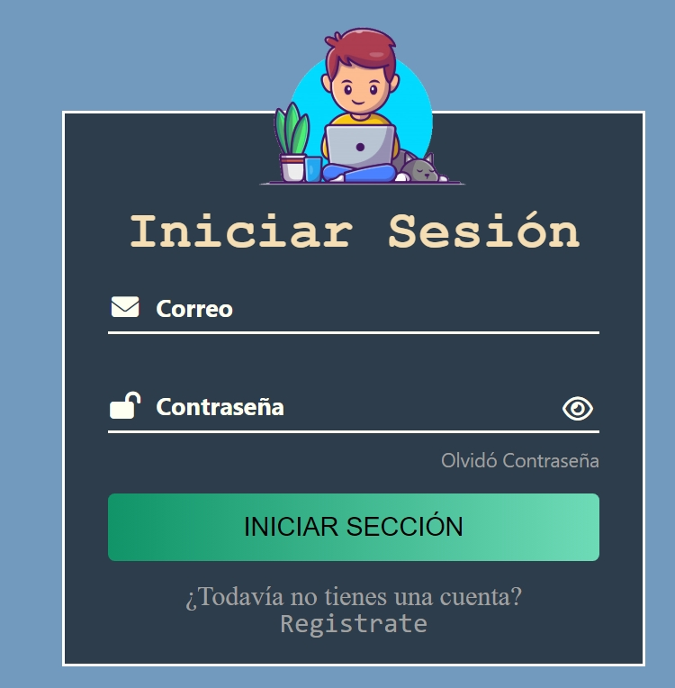
     

2.  **Aplicación de Contactos**

    - Es una aplicación de escritorio desarrollada en Java utilizando JavaFX, diseñada para que cada usuario pueda gestionar su propia lista de contactos de forma sencilla e intuitiva. Para acceder a la aplicación, los usuarios deben registrarse e iniciar sesión. Cada cuenta de usuario cuenta con su propia lista de contactos, implementada mediante una estructura de datos personalizada de listas doblemente enlazadas creada específicamente para este proyecto.
    - Tecnologías:
      - Java (JDK): Lenguaje de programación principal utilizado para la lógica de la aplicación.
      - JavaFX: Framework de interfaz gráfica utilizado para crear una experiencia visual amigable e interactiva.
      - Listas doblemente enlazadas personalizadas: Estructura de datos implementada manualmente para almacenar y gestionar los contactos de cada usuario.
      - Herencia en Java: Principio de la programación orientada a objetos aplicado para organizar y reutilizar el código.
    - Funcionalidades principales:
      - Registro e inicio de sesión de usuarios con credenciales únicas.
      - Cada usuario cuenta con su propia lista de contactos independiente.
      - Creación de nuevos contactos con información como nombre, número de teléfono, dirección, correo electrónico y foto.
      - Posibilidad de marcar contactos como favoritos para acceso rápido.
      - Edición y eliminación de contactos existentes.
      - Interfaz gráfica intuitiva desarrollada con JavaFX para facilitar la navegación y la gestión de la información.
    - Estado: Completo
    - [Repositorio](https://github.com/mfalvarezd/Contactos){:target="\_blank"} |

    

      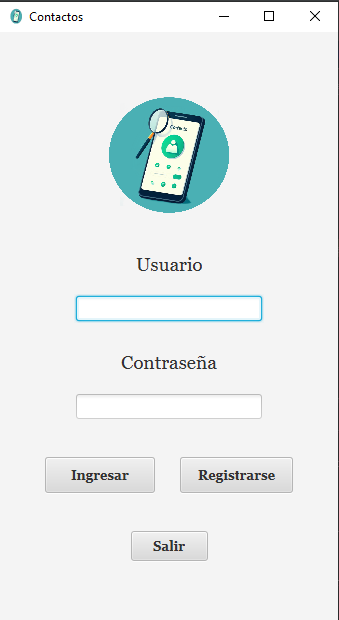
      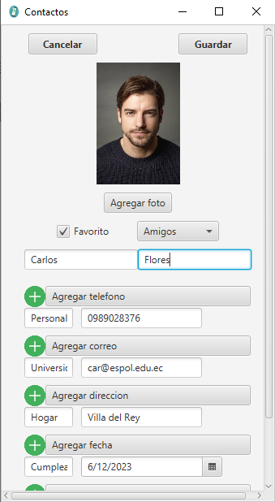
      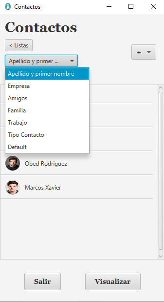
    

3.  **Juego de Tres en Raya con IA**

    - Es una aplicación de escritorio desarrollada en Java utilizando JavaFX, diseñada para que el usuario compita contra la máquina en una partida de tres en raya. El sistema utiliza estructuras de datos y algoritmos basados en árboles para simular y analizar todas las posibles jugadas, permitiendo que la máquina seleccione siempre la mejor opción para ganar o evitar la derrota.
    - Tecnologías:
      - Java (JDK): Lenguaje de programación principal utilizado para implementar la lógica del juego y la interfaz.
      - JavaFX: Framework de interfaz gráfica utilizado para crear un entorno visual interactivo donde el usuario pueda jugar de manera intuitiva.
      - Árboles: Estructura de dato empleada para modelar las posibles jugadas del juego, analizando los movimientos futuros tanto de la máquina como del usuario.
      - Algoritmos de búsqueda: Utilizados para recorrer el árbol de jugadas y seleccionar el movimiento óptimo.
    - Funcionalidades principales:
      - Interfaz gráfica amigable que muestra el tablero de juego y permite al usuario seleccionar sus movimientos.
      - Lógica de juego automática que analiza todas las posibilidades y elige la jugada más ventajosa para la máquina.
      - Árbol de decisiones que modela turnos alternados entre usuario y máquina, evaluando las mejores rutas hacia la victoria.
      - Partidas rápidas y rejugables, con posibilidad de reiniciar y volver a competir.
    - Estado: Completo
    - [Repositorio](https://github.com/Darloscode/Tres-en-Raya){:target="\_blank"} |

     

       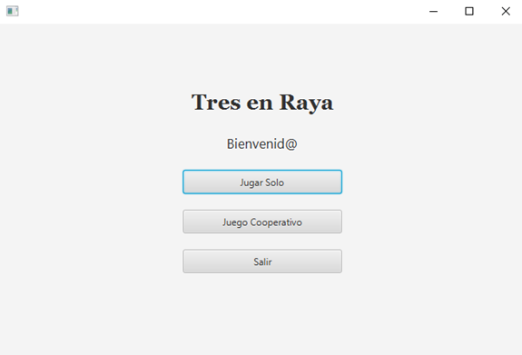
     

     

       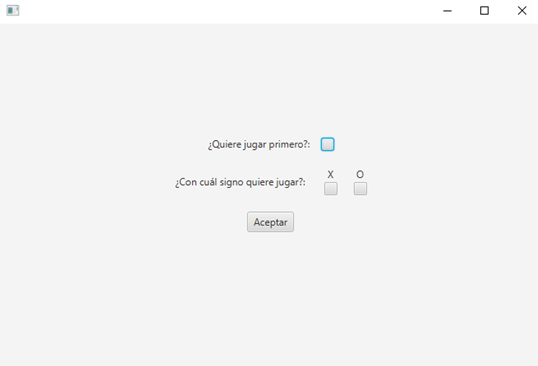
     

     

       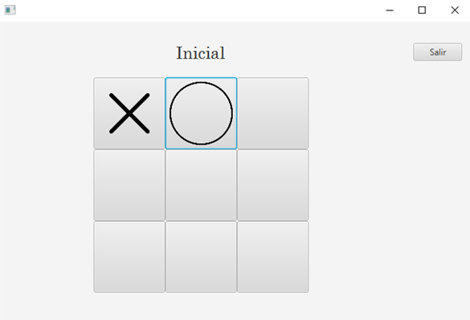
     

     

       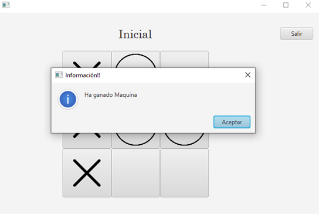
     

4.  **Landing Page de venta de autos (AutoElite)**

    - Es una Landing Page para la venta de autos, llamada AutoElite, diseñada para ofrecer una experiencia de compra intuitiva y atractiva.
    - Tecnologías:
      - Visual Studio Code: Utilizado para desarrollar el proyecto y administrar el código fuente.
      - HTML y CSS: Proporcionan la estructura y el diseño atractivo para captar la atención de los clientes.
      - JavaScript: Añade interactividad a la página, como animaciones y permite conexción con una base de datos, envía y recibe los datos en formato JSON.
      - Firebase: Sirve como backend para almacenar datos, gestionar usuarios y ofrecer análisis básicos.
    - Estado: Completo
    - [Repositorio](https://github.com/Darloscode/landing){:target="\_blank"} | [Sitio Web](https://darloscode.github.io/landing/){:target="\_blank"}

  

    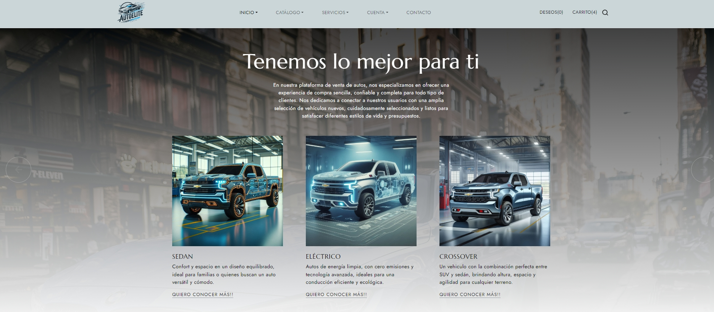
  

5.  **Dashboard sobre el clima**

- Dashboard interactivo que proporciona información actualizada sobre las condiciones climáticas de diferentes ubicaciones.
- Tecnologías:
  - Visual Studio Code: Usado para codificar la interfaz y lógica del dashboard.
  - React: Facilita el desarrollo de componentes interactivos y administra el estado del dashboard
- Estado: Completo
- [Repositorio](https://github.com/Darloscode/dashboard){:target="\_blank"} | [Sitio Web](https://darloscode.github.io/dashboard){:target="\_blank"}

    

      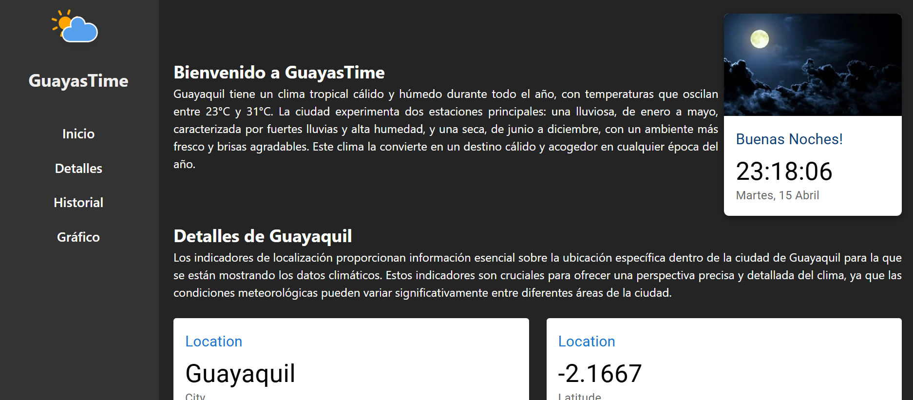
    

6.  **Galería de Fotos**

- Es una aplicación de Galería de Fotos creada con Java y JavaFX, diseñada para gestionar y visualizar imágenes de manera fácil e interactiva. La aplicación permite a los usuarios crear álbumes, agregar fotos a dichos álbumes, así como borrar fotos.
- Tecnologías:
  - NetBeans: IDE utilizado para desarrollar y depurar la aplicación en Java.
  - Java: Lenguaje principal del proyecto para manejar la lógica de la aplicación y gestionar las fotos.
  - JavaFX: Framework que ofrece una interfaz gráfica moderna y amigable para que los usuarios puedan interactuar con la galería.
- Estado: Completo
- [Repositorio](https://github.com/Darloscode/Project-Photo-Gallery){:target="\_blank"} |

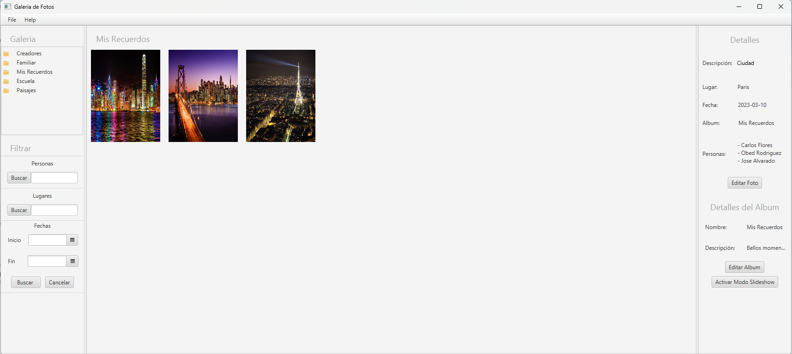

7.  **Aplicación Híbrida**

    - Es una aplicación híbrida desarrollada con Angular e Ionic, diseñada para ayudar a las ciudadelas a identificar y clasificar automáticamente los problemas que reportan los residentes. Los usuarios pueden subir una foto del inconveniente (como basura en el suelo o autos mal estacionados), y el sistema utiliza inteligencia artificial para clasificarlo correctamente.
      Angular: Framework frontend utilizado para construir la interfaz interactiva y modular de la aplicación.
    - Tecnología:
      - Ionic: Framework que permite desarrollar aplicaciones móviles híbridas, facilitando la integración con Angular y permitiendo la ejecución en dispositivos móviles.
      - Teachable Machine: Herramienta de inteligencia artificial de Google utilizada para entrenar un modelo capaz de identificar visualmente los problemas en las imágenes subidas por los usuarios.
      - Firebase: Utilizado como backend para almacenar los reportes de los usuarios y mantener sincronizados los datos en tiempo real.
    - Funcionalidades principales:
      - Subida de imágenes por parte de los residentes para reportar problemas en su ciudadela.
      - Clasificación automática de los reportes (por ejemplo: basura o autos mal estacionados) usando el modelo entrenado.
      - Visualización de todos los reportes desde una pantalla principal, para que tanto los residentes como la administración puedan tomar medidas y dar seguimiento a las incidencias.
    - Estado: Completo
    - [Repositorio](https://github.com/Darloscode/hibrida){:target="\_blank"} |

    

      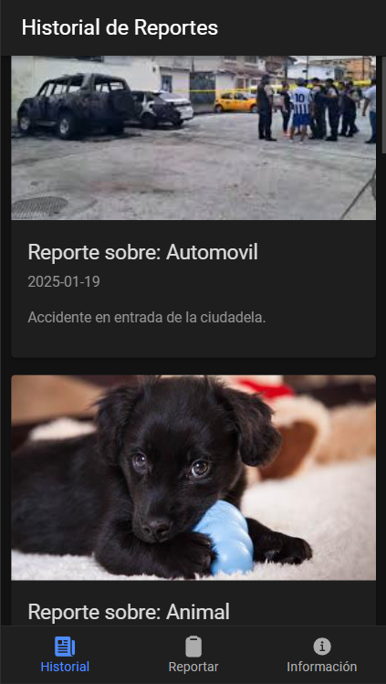
      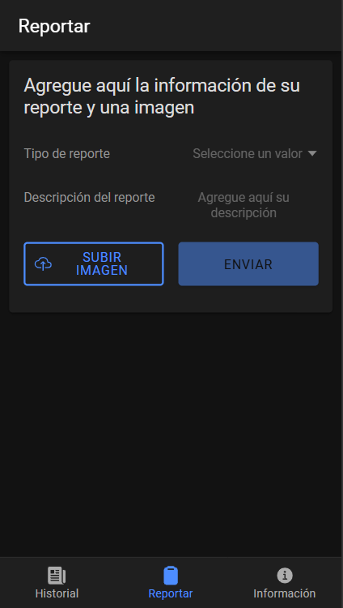
      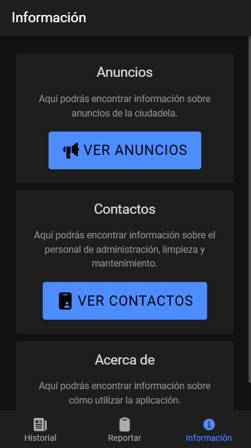
    

8.  **Backend**

    - Es una aplicación web desarrollada con Django, que se conecta a una base de datos en Firebase para visualizar y analizar datos en tiempo real. La información se presenta en una plantilla web con tablas organizadas y gráficos.
    - Tecnologías:
      - Django: Framework backend utilizado para estructurar la lógica del servidor, gestionar rutas y renderizar las vistas.
      - Firebase: Base de datos NoSQL en la nube que almacena los datos en formato JSON y permite sincronización en tiempo real.
      - PythonAnywhere: Plataforma de hosting utilizada para desplegar la aplicación y hacerla accesible desde cualquier navegador.
    - Funcionalidades:
      - Conexión con Firebase para obtener y mostrar datos en tiempo real.
      - Visualización de la cantidad total de datos almacenados.
      - Presentación de la primera y última entrada registrada.
      - Representación gráfica de los datos para facilitar el análisis (respuestas por hora y día).
      - Organización de la información en una tabla.
    - Estado: Completo
    - [Repositorio](https://github.com/Darloscode/backend){:target="\_blank"} |

    

      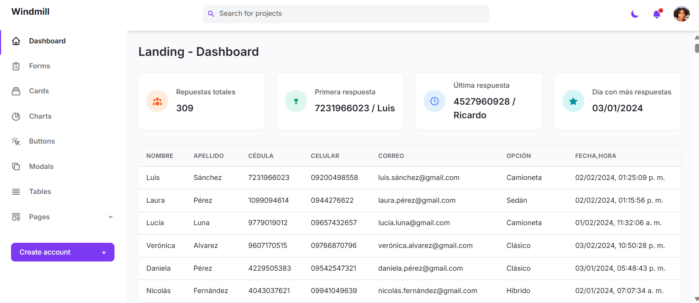
    

9.  **Plataforma de Citas Médicas – Fundación Aspy**

    - Es una aplicación web desarrollada en React, diseñada para que los pacientes de la Fundación Aspy puedan agendar y gestionar sus citas médicas de forma rápida y sencilla. La plataforma permite a los administradores, secretarios y profesionales de la salud organizar los horarios y mantener un control centralizado de las atenciones, mientras que los pacientes pueden seleccionar el servicio, el profesional y la fecha de su cita de manera intuitiva. Los profesionales pueden generar reportes médicas de las citas.
    - Tecnologías:
      - React: Biblioteca de JavaScript utilizada para construir una interfaz de usuario dinámica, modular y responsiva.
      - Laravel (PHP): Framework backend encargado de gestionar la lógica del servidor, el acceso a la base de datos y las APIs de comunicación con el frontend.
      - PostgreSQL: Sistema de gestión de bases de datos utilizado para almacenar la información de usuarios, citas y servicios médicos.
    - Funcionalidades:
      - Registro e inicio de sesión para pacientes, profesionales y administradores.
      - Visualización de la disponibilidad de horarios para cada servicio y profesional.
      - Agendamiento de citas médicas seleccionando servicio, profesional y fecha/hora.
      - Gestión de citas: seguimiento de estado.
      - Panel de control para administradores con vista global de todas las citas y usuarios.
    - Estado: En proceso
    - [Repositorio](https://github.com/Aspy-Ecuador/app){:target="\_blank"} |

    

      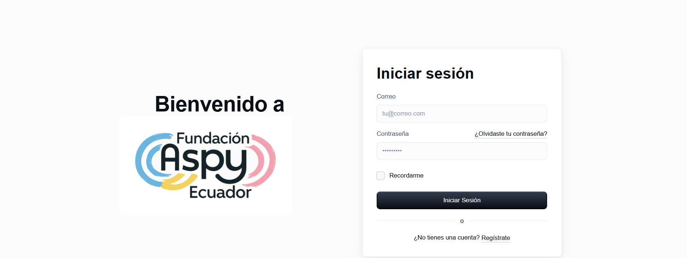
    

    

      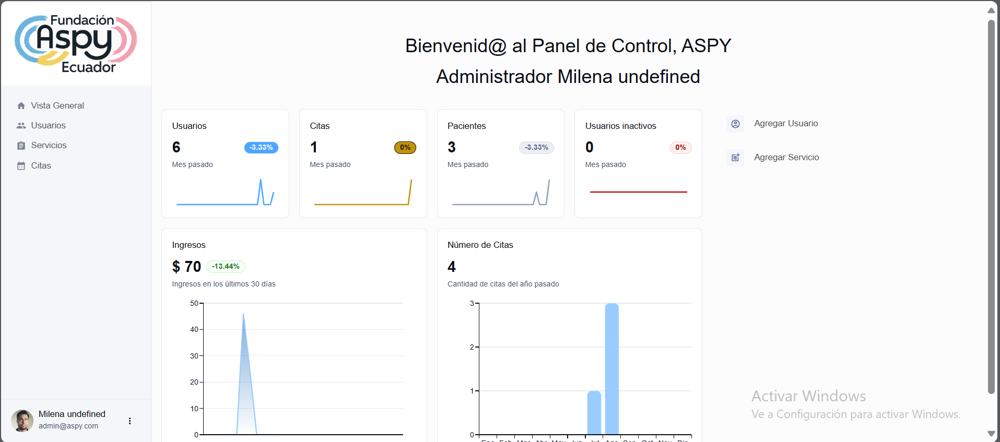
    

## Tecnologías y Habilidades 🤖

- **Frameworks y Librerías:** React, NumPy, JavaFX, PHP, TypeScript, Ionic, Angular
- **Bases de Datos:** MySQL, Firebase
- **Herramientas, Plataformas y Entornos de Desarrollo :** Git, Visual Studio Code, Figma, MySQL Workbench, NetBeans, XAMPP

 
 
 

## Lenguajes 🚀

 
       

## Contacto 🤝

## Estadísticas en GitHub 📊

 

 

 

